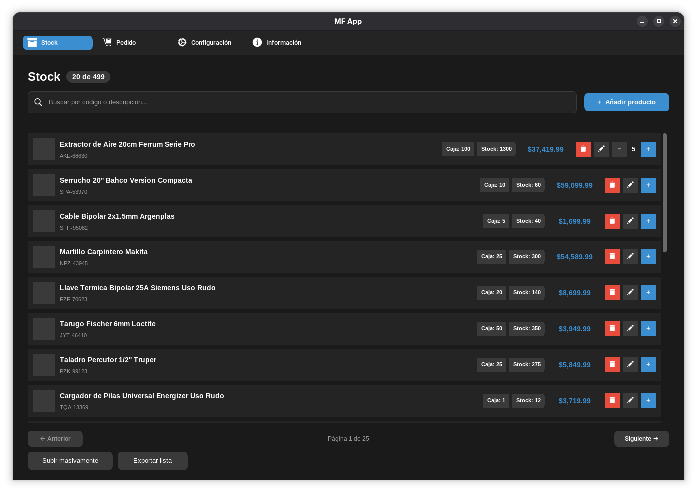
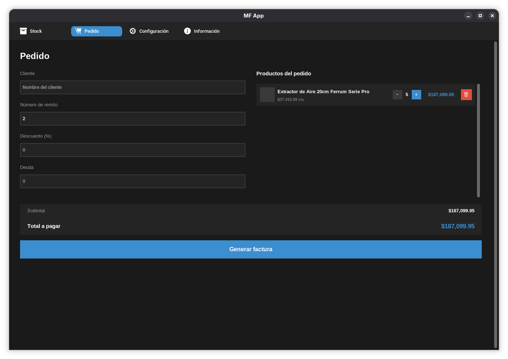
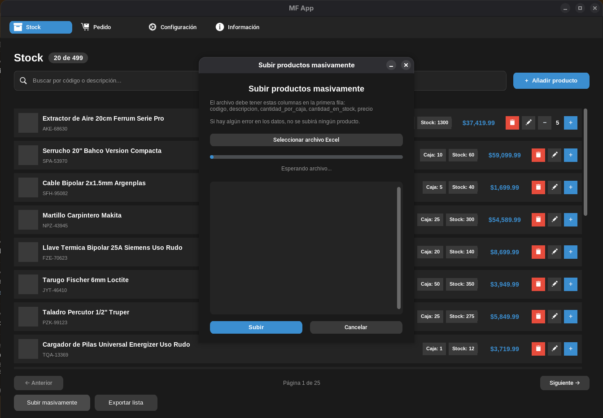
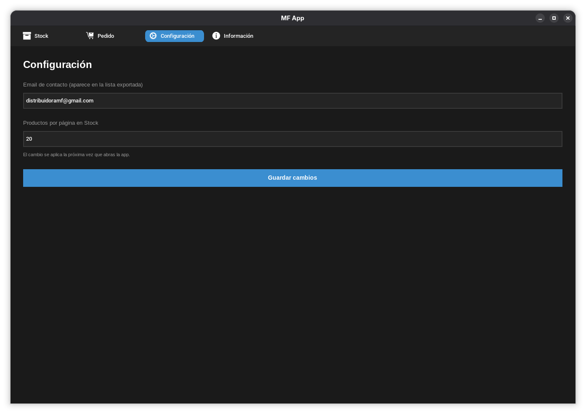

# MF App

**Versión 1.0.0**

Sistema de escritorio para la gestión de stock, pedidos y facturación de **MF Distribuidora**. Reemplaza el manejo manual de planillas y cuadernos: cargar productos, controlar cantidades, armar pedidos y generar facturas ahora se hace desde una sola aplicación, en segundos.

## Capturas






## Qué hace

**Stock**
- Alta, edición y baja de productos, con imagen, código, descripción, precio, cantidad en stock y cantidad por caja.
- Búsqueda instantánea por código o descripción, sin distinguir mayúsculas ni tildes.
- Carga masiva de productos desde un Excel, con validación fila por columna: si hay un solo error, no se sube nada hasta corregirlo.
- Exportación de la lista de precios a un Excel con diseño propio, listo para compartir con clientes.
- Las imágenes de cada producto se procesan automáticamente (se comprimen, se escalan y se les quita la transparencia) para que la app se mantenga liviana.

**Pedido**
- Carrito de productos compartido con Stock: se agregan productos directamente desde la pantalla de Stock, y se ven reflejados en Pedido en tiempo real.
- Cálculo automático de subtotal, descuento, deuda y total a pagar.
- Generación de factura en Excel, con dos copias en la misma hoja (vendedor y cliente), formateada para imprimir en A4.
- Al facturar, se descuenta automáticamente el stock vendido y se sube el número de remito para el próximo pedido.
- Aviso si se intenta facturar más cantidad de la que hay disponible en stock.

**Respaldo y seguridad**
- Backup automático y comprimido de la base de datos en cada acción importante (alta, edición, baja, carga masiva, facturación), manteniendo los últimos 30.
- Registro de warnings y errores en un log diario, útil para diagnosticar problemas sin depender de una consola visible.

**Configuración**
- Email de contacto que aparece en la lista exportada.
- Cantidad de productos a mostrar por página en Stock.

## Estructura del proyecto

```
mf-app/
├── functions/
│   ├── db.py
│   ├── paths.py
│   ├── logger.py
│   ├── config.py
│   ├── carrito.py
│   ├── exportar_lista.py
│   └── facturar.py
├── ui/
│   ├── components/
│   │   ├── topbar.py
│   │   ├── fila_producto.py
│   │   └── toast.py
│   └── pages/
│       ├── stock.py
│       ├── pedido.py
│       ├── configuracion.py
│       ├── informacion.py
│       ├── agregar_producto.py
│       ├── confirmar_eliminar.py
│       └── subir_masivo.py
├── assets/
│   ├── icons/
│   ├── icon.ico
│   └── icon.png
├── app.py
├── main.py
└── requirements.txt
```

## Requisitos

- Windows 10/11
- Python 3.10+ (solo para correr desde el código fuente; el ejecutable no lo necesita)
- Dependencias en `requirements.txt`

## Instalación (desde código fuente)

```bash
python -m venv venv
venv\Scripts\activate
pip install -r requirements.txt
python main.py
```

---

Diseñado y programado por **TC**